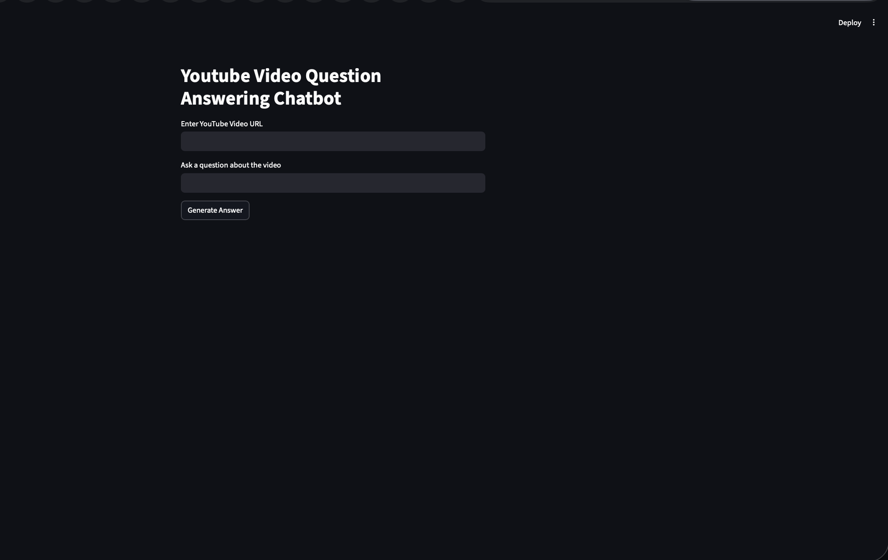
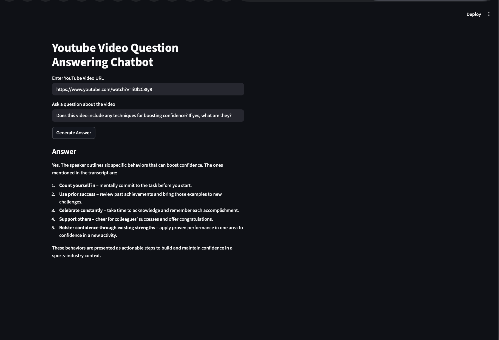

# 🎥 YouTube RAG Assistant

A RAG-based AI chatbot that answers questions from YouTube videos using transcript retrieval, semantic search, and LLMs.

Built using LangChain, FAISS, Groq, HuggingFace Embeddings, and Streamlit.

---------------------------

## 🚀 Features

* Extracts YouTube video transcripts
* Semantic search using FAISS vector database
* Retrieval-Augmented Generation (RAG)
* Answers questions based on video content
* Interactive Streamlit UI

---------------------------

## 🛠️ Tech Stack

* Python
* LangChain
* FAISS
* HuggingFace Embeddings
* Groq API
* Streamlit

---------------------------

## 📂 Project Structure

youtube-rag-assistant/

    app.py
    requirements.txt
    README.md
    .gitignore

    src/
    transcript.py
    chunking.py
    vectorstore.py
    rag_chain.py

---------------------------

## ⚙️ Setup

### Clone Repository

bash 
git clone https://github.com/YOUR_USERNAME/youtube-rag-assistant.git

### Install Dependencies

bash
pip install -r requirements.txt

### Add Environment Variable

Create a `.env` file:

env
GROQ_API_KEY=your_api_key

### Run App

bash 
streamlit run app.py

---------------------------

## 📸 Demo

---------------------------

## 🧠 RAG Pipeline

YouTube Video
    ↓
Transcript Extraction
    ↓
Chunking
    ↓
Embeddings
    ↓
FAISS Retrieval
    ↓
LLM Response Generation

---------------------------

## 👨‍💻 Author

Aditi Gupta

